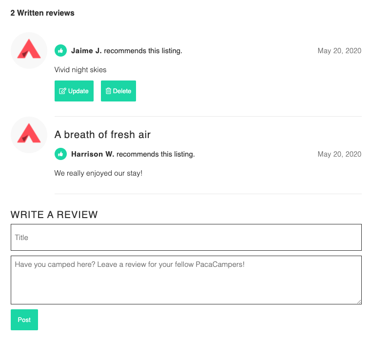

  

    <a href="http://pacacamp.herokuapp.com/#/">Live site</a>

# PacaCamp

PacaCamp is a full-stack, single-page Hipcamp clone that helps users discover and book unique outdoor experiences. 

## Table of Contents 

- [Technologies](#technologies)
- [Languages](#languages)
- [Features](#features)
  * [User Authentication](#user-authentication)
  * [Listings](#listings)
  * [Bookings](#bookings)
  * [Reviews](#reviews)
  * [Search](#search)
- [Future Directions](#future-directions)

## Technologies

- Ruby on Rails for backend framework
- PostgreSQL as backend database
- React for user interface
- Redux for state management
- Git for version control
- AWS S3
- Google Maps API
- DayPicker API

## Languages 

- JavaScript
- Ruby
- HTML5
- CSS3

## Features

### User Authentication

  

- Account creation utilizes BCrypt for password security. 
- Site employs responsive modal forms for login and signup.
- Visitors are unable to access certain features without logging in (i.e. creating and deleting reservations, writing reviews).

### Listings

  

- Visitors can browse campsites.
- Each listing displays photos, campsite information, a Google Map, and reviews.

### Bookings

  

- Booking form uses DayPicker API to enable users to easily select trip start and end dates.
- Visitors are prompted to log in, if they are not already, in order to make reservations.
- Users can create, view, and cancel their own reservations.

### Reviews

  

- Visitors can view campsite reviews.
- Users can leave, edit, and delete their own reviews.

### Search
- Visitors can search campsites by location.
- Google Maps is implemented on search.

## Future Directions
- Enable users to add, update, and delete campsites.
- Implement filters (group size, pricing, amenities, activites) on search. 
